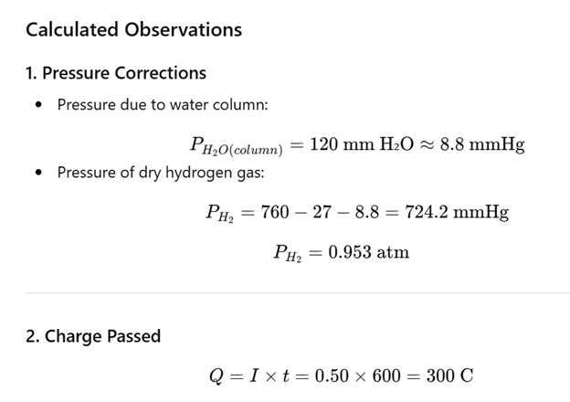
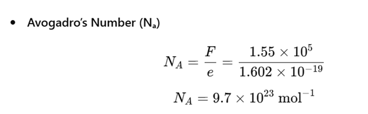

## Procedure:

●	Assemble the apparatus and get a DC source with an attached ammeter.

●	Take a 250ml beaker and add 100ml of distilled water.

●	Further, slowly add 50ml of dilute (3M) Sulfuric acid to this solution.

●	Take the solution and pour into a 50ml burette and invert it into the solution. Use a ring stand, and a clamp to hold it in place.

●	Attach the copper wire cathode to the negative terminal of the DC source and place the other end uninsulted into the inverted mouth of the burette.

●	The anode electrode should be immersed in the acid solution and hung over the edge of the beaker, with the other end attached to the positive electrode of the DC source.

●	Turn on the DC source, then record the time and the ammeter reading.

●	Try to maintain a steady current throughout. If the current fluctuates during electrolysis, then use an average value.

●	Collect at least 20ml of hydrogen during the electrolysis.

●	Then note the time you ceased the process of electrolysis.

## Measure the following:

The volume of H2 collected.

The height of the water column in mm in the burette.

The temperature of the acid solution.

The Barometric pressure.

The vapor pressure of water at the solution temperature.

Note the following:

PH2 = P Barometric  -P H20 column - P H20 Vapour
	
PH20 column  = (density of H2O) × gravity × (height of H2O)= (height of H2O in mm) × 9.81 Pa

### Observation Table:
<b>Parameter | <b>Observed Value
:--|:--|
 Current,I |0.50A
 Initial time,1 |0s
 Final time,t2 |600s
 Time of electrolysis, t |600s
 Volume of H2 collected, V |25.0 mL = 2.5 × 10-5 m3
 Height of water column, h |120mm
 Temperature of solution, T |27 °C = 300 K
 Barometric pressure, P₍atm₎</su> |760 mmHg
 Vapor pressure of water at 27 °C |27 mmHg

  

  

  

## Precautions:- 
The entire bare part of the wire should be inside the burette; otherwise, some of the H2 generated will not be collected in the burette. 
To calculate the volume, the top of the solution in the burette should be within the graduated region of the burette. 
Electrodes should remain static during the process of electrolysis. 

